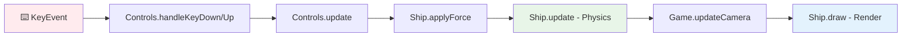

# 🚀 Spaceship Game - Documentación Técnica

## 📋 Índice
1. [Arquitectura General](#arquitectura-general)
2. [Componentes del Sistema](#componentes-del-sistema)
3. [Diagrama de Flujo de Ejecución](#diagrama-de-flujo-de-ejecución)
4. [Sistema de Coordenadas 3D](#sistema-de-coordenadas-3d)
5. [Algoritmos Clave](#algoritmos-clave)
6. [Análisis de Rendimiento](#análisis-de-rendimiento)

---

## 🏗️ Arquitectura General

El juego implementa una arquitectura **MVC (Model-View-Controller)** adaptada para un entorno de juego:

```
┌─────────────────┐    ┌─────────────────┐    ┌─────────────────┐
│   CONTROLLER    │    │      MODEL      │    │      VIEW       │
│   (Controls)    │◄──►│     (Ship)      │◄──►│     (Game)      │
│                 │    │                 │    │                 │
│ - Input Handler │    │ - Physics       │    │ - Rendering     │
│ - Key Mapping   │    │ - State         │    │ - UI Updates    │
│ - Force Apply   │    │ - Collision     │    │ - Canvas Mgmt   │
└─────────────────┘    └─────────────────┘    └─────────────────┘
```

### Patrón de Comunicación
- **Controls** → **Ship**: Aplica fuerzas (`applyForce()`)
- **Ship** → **Game**: Proporciona estado para rendering
- **Game** → **Controls**: Proporciona referencia de cámara
- **Game** → **UI**: Actualiza elementos DOM

---

## 🧩 Componentes del Sistema

### 1. **Clase Ship** (Model - Física de la nave)

```javascript
class Ship {
    constructor(x = 0, y = 0, z = 0) {
        this.position = { x, y, z };        // Vector3 posición mundial
        this.velocity = { x: 0, y: 0, z: 0 }; // Vector3 velocidad
        this.acceleration = { x: 0, y: 0, z: 0 }; // Vector3 aceleración
        this.maxSpeed = 5;                   // Límite velocidad
        this.friction = 0.98;               // Factor fricción espacial
        this.size = 10;                     // Tamaño para rendering
    }
}
```

#### **Algoritmo de Física (Integración de Euler):**
```
1. v(t+1) = v(t) + a(t) * dt          // Actualizar velocidad
2. v(t+1) = v(t+1) * friction         // Aplicar fricción
3. v(t+1) = clamp(v(t+1), -maxSpeed, maxSpeed)  // Limitar velocidad
4. p(t+1) = p(t) + v(t+1) * dt        // Actualizar posición
5. a(t+1) = 0                         // Reset aceleración
```

### 2. **Clase Controls** (Controller - Gestión de Input)

```javascript
class Controls {
    constructor(ship, game = null) {
        this.ship = ship;               // Referencia a nave
        this.game = game;               // Referencia a juego (cámara)
        this.keys = {};                 // Estado de teclas
        this.force = 0.5;              // Magnitud de fuerza
        this.cKeyPressed = false;       // Anti-bounce para toggle
    }
}
```

#### **Mapa de Controles:**
| Tecla | Acción | Vector de Fuerza |
|-------|--------|------------------|
| W     | Adelante | `(0, -0.5, 0)` |
| S     | Atrás    | `(0, +0.5, 0)` |
| A     | Izquierda| `(-0.5, 0, 0)` |
| D     | Derecha  | `(+0.5, 0, 0)` |
| Q     | Arriba   | `(0, 0, -0.5)` |
| E     | Abajo    | `(0, 0, +0.5)` |
| +/-   | Zoom     | `scale *= 1.02/0.98` |
| C     | Toggle   | `followShip = !followShip` |

### 3. **Clase Game** (View/Controller - Motor de Renderizado)

```javascript
class Game {
    constructor() {
        // Canvas contexts
        this.ctxTop = canvasTop.getContext('2d');
        this.ctxSide = canvasSide.getContext('2d');
        
        // Sistema de cámara
        this.camera = {
            x: 0, y: 0, z: 0,          // Posición 3D de cámara
            scale: 1,                   // Factor de zoom
            followShip: true            // Modo de seguimiento
        };
        
        // Entidades del mundo
        this.ship = new Ship();
        this.planets = [...];          // Array de planetas estáticos
    }
}
```

---

## 🔄 Diagrama de Flujo de Ejecución

### **Game Loop Principal (60 FPS)**

```mermaid
graph TD
    A[🎮 Game.animate()] --> B[📷 updateCamera()]
    B --> C[🧹 clearCanvas()]
    C --> D[🎯 drawGrid()]
    D --> E[🪐 drawPlanets()]
    E --> F[⌨️ controls.update()]
    F --> G[🚀 ship.update()]
    G --> H[🎨 ship.draw()]
    H --> I[📊 updateUI()]
    I --> J[🔄 requestAnimationFrame()]
    J --> A
    
    style A fill:#e1f5fe
    style F fill:#f3e5f5
    style G fill:#e8f5e8
    style H fill:#fff3e0
```

### **Flujo de Input → Física → Rendering**



### **Sistema de Proyección 3D → 2D**

```mermaid
graph TD
    A[Coordenadas 3D World<br/>x, y, z] --> B{Vista?}
    B -->|TOP| C[Proyección XY<br/>screenX = centerX + (worldX - cameraX) * scale<br/>screenY = centerY + (worldY - cameraY) * scale]
    B -->|SIDE| D[Proyección XZ<br/>screenX = centerX + (worldX - cameraX) * scale<br/>screenY = centerY + (worldZ - cameraZ) * scale]
    C --> E[Canvas Top Context]
    D --> F[Canvas Side Context]
    
    style A fill:#f1f8e9
    style C fill:#e8eaf6
    style D fill:#fce4ec
```

---

## 📐 Sistema de Coordenadas 3D

### **Convenciones de Ejes:**
```
     Y (Adelante/Atrás)
     ↑
     |
     |
     └────→ X (Izquierda/Derecha)
    /
   /
  ↙
 Z (Arriba/Abajo)
```

### **Transformación de Coordenadas:**

#### **Vista Superior (XY Plane):**
```javascript
screenX = canvas.width/2 + (worldX - cameraX) * scale
screenY = canvas.height/2 + (worldY - cameraY) * scale
// Z se ignora en esta proyección
```

#### **Vista Lateral (XZ Plane):**
```javascript
screenX = canvas.width/2 + (worldX - cameraX) * scale
screenY = canvas.height/2 + (worldZ - cameraZ) * scale
// Y se ignora en esta proyección
```

### **Planetas - Coordenadas Absolutas:**
```javascript
planets = [
    { name: 'Mercury', x: -300, y: -200, z: 0,    radius: 8  },
    { name: 'Venus',   x: 400,  y: 250,  z: -80,  radius: 12 },
    { name: 'Earth',   x: -500, y: 350,  z: 120,  radius: 15 },
    { name: 'Mars',    x: 600,  y: -300, z: -100, radius: 10 },
    { name: 'Jupiter', x: -700, y: -500, z: 200,  radius: 35 }
];
```

---

## ⚡ Algoritmos Clave

### 1. **Smooth Camera Following**
```javascript
// Interpolación lineal suave
updateCamera() {
    if (this.camera.followShip) {
        const lerp_factor = 0.1; // Factor de suavizado
        this.camera.x += (this.ship.position.x - this.camera.x) * lerp_factor;
        this.camera.y += (this.ship.position.y - this.camera.y) * lerp_factor;
        this.camera.z += (this.ship.position.z - this.camera.z) * lerp_factor;
    }
}
```
**Complejidad:** O(1)  
**Efecto:** Cámara sigue nave con retraso suave, evitando movimientos bruscos

### 2. **Frustum Culling (Planets)**
```javascript
drawPlanet(ctx, planet, view) {
    const screenX = ctx.canvas.width/2 + (planet.x - this.camera.x) * this.camera.scale;
    const screenY = ctx.canvas.height/2 + (viewY - this.camera[viewAxis]) * this.camera.scale;
    
    // AABB Collision Detection para visibilidad
    if (screenX > -planet.radius && screenX < ctx.canvas.width + planet.radius &&
        screenY > -planet.radius && screenY < ctx.canvas.height + planet.radius) {
        // Solo renderizar si está visible
        renderPlanet(ctx, screenX, screenY, planet);
    }
}
```
**Complejidad:** O(n) donde n = número de planetas  
**Optimización:** Solo dibuja planetas visibles en pantalla

### 3. **Grid Rendering con Offset Dinámico**
```javascript
drawGrid(ctx) {
    const gridSize = 50;
    
    // Calcular offset para movimiento fluido
    const offsetX = (this.camera.x % gridSize) * this.camera.scale;
    const offsetY = (this.camera.y % gridSize) * this.camera.scale;
    
    // Dibujar líneas con offset
    for(let x = -gridSize; x < width + gridSize; x += gridSize) {
        const drawX = x - offsetX;
        ctx.moveTo(drawX, 0);
        ctx.lineTo(drawX, height);
    }
}
```
**Efecto:** Grid infinito que se mueve suavemente con la cámara

### 4. **Anti-Bounce Key Toggle**
```javascript
// Prevenir activación múltiple en una pulsación
if (this.keys['c'] && !this.cKeyPressed) {
    this.game.camera.followShip = !this.game.camera.followShip;
    this.cKeyPressed = true;  // Marcar como procesado
} else if (!this.keys['c']) {
    this.cKeyPressed = false; // Reset cuando se suelta
}
```
**Problema resuelto:** Evita toggle múltiple por frames de una sola pulsación

---

## 📊 Análisis de Rendimiento

### **Complejidad Computacional por Frame:**

| Componente | Complejidad | Operaciones |
|------------|-------------|-------------|
| Input Processing | O(1) | ~8 key checks |
| Physics Update | O(1) | Vector operations |
| Camera Update | O(1) | 3 lerp calculations |
| Planet Rendering | O(n) | n = 7 planetas |
| Grid Rendering | O(g) | g = ~20 líneas de grid |
| Ship Rendering | O(1) | 2 draw calls |
| UI Update | O(1) | DOM updates |

**Total:** O(n + g) ≈ O(1) para número fijo de elementos

### **Optimizaciones Implementadas:**

1. **Frustum Culling:** Solo renderiza objetos visibles
2. **Canvas Clearing:** Solo limpia área necesaria
3. **Interpolación de Cámara:** Suaviza movimientos sin cálculos complejos
4. **Estado de Teclas:** Evita polling constante del teclado
5. **RequestAnimationFrame:** Sincronización con VSync del navegador

### **Memoria Utilizada:**
```
- Ship instance: ~200 bytes (6 vectors3 + properties)
- Camera state: ~50 bytes (5 properties)  
- Planets array: ~350 bytes (7 objects × ~50 bytes)
- Controls state: ~100 bytes (key maps + flags)
- Canvas contexts: ~Managed by browser
```

### **Posibles Mejoras:**
1. **Object Pooling** para efectos de partículas
2. **Spatial Partitioning** si se añaden más planetas
3. **Level of Detail** para planetas distantes
4. **WebGL** para operaciones 3D nativas

---

## 🎯 Conclusiones Técnicas

Este juego implementa exitosamente:

✅ **Sistema de Vista Diédrica Real** - Dos proyecciones simultáneas del espacio 3D  
✅ **Física Espacial Realista** - Integración de Euler con fricción  
✅ **Cámara Inteligente** - Seguimiento suave con zoom  
✅ **Optimización de Rendering** - Frustum culling y cálculos mínimos  
✅ **Controles Responsivos** - Anti-bounce y mapeo intuitivo  

**Arquitectura Escalable:** El patrón MVC permite añadir fácilmente nuevas características sin romper el código existente.

---

*Documentación generada para diedric-space-game-demo v1.0*
